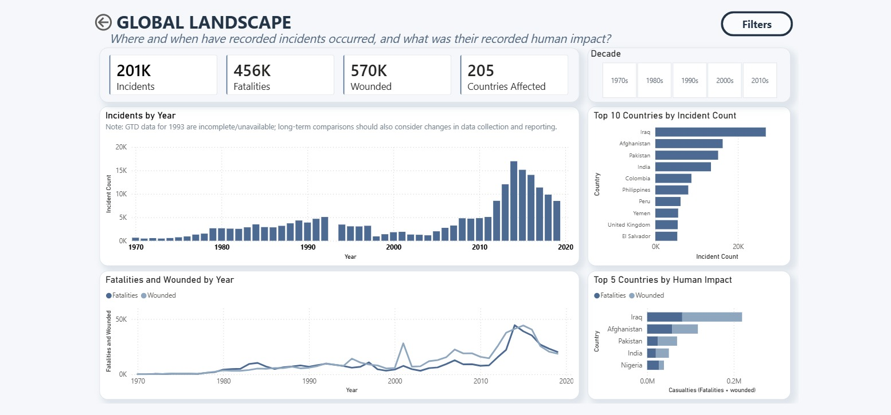
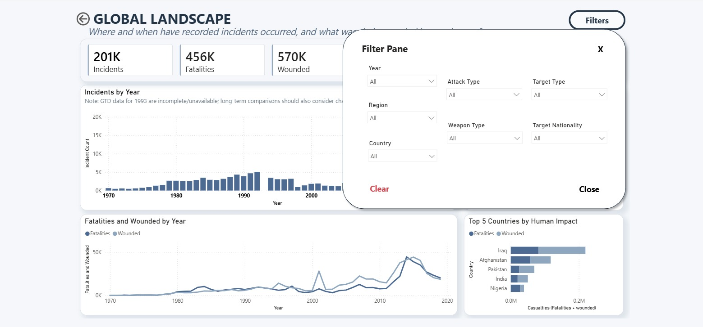
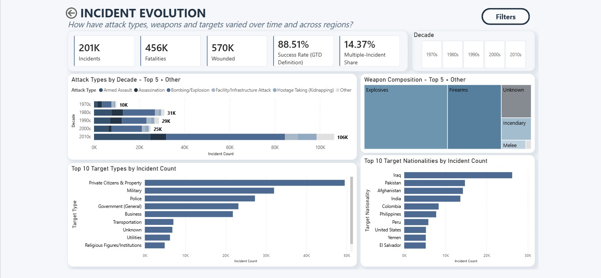
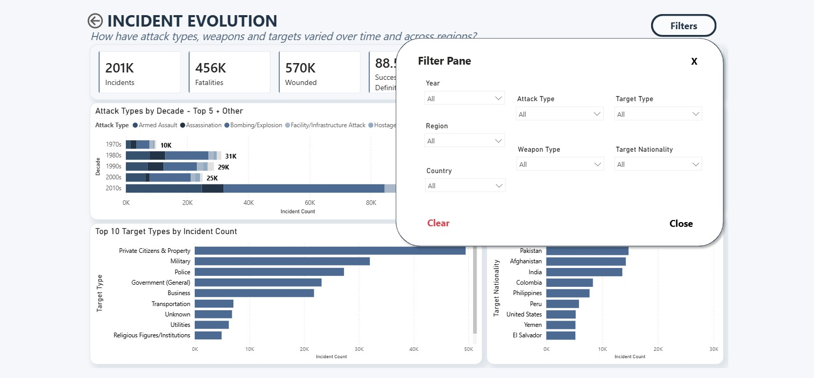
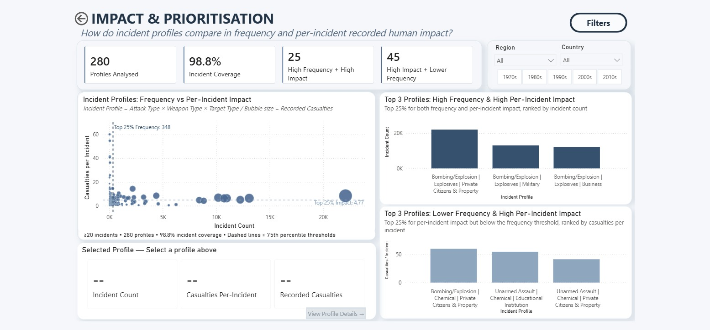
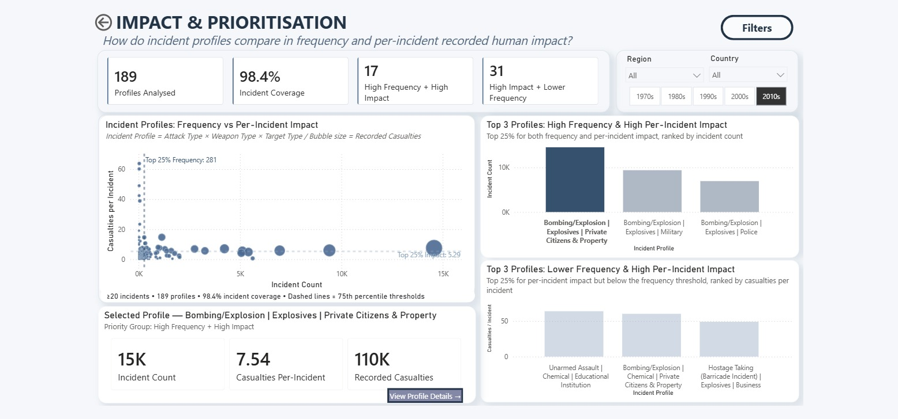
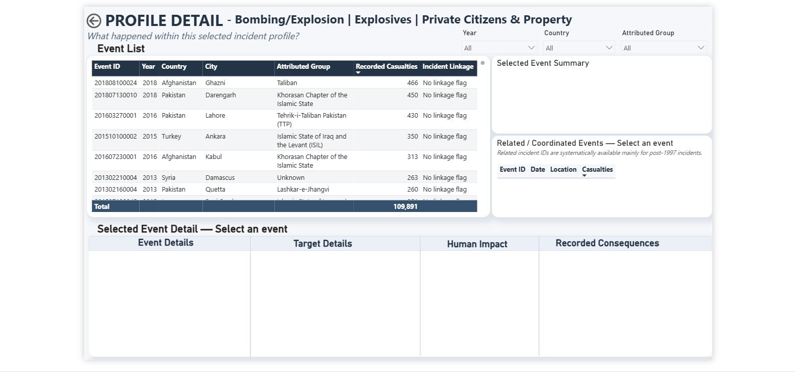
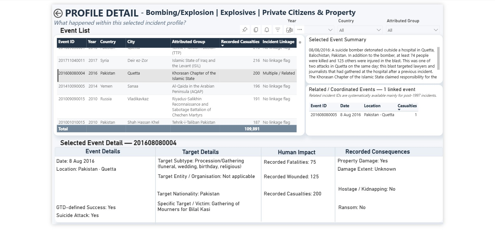

# Global Terrorism: Trends & Human Impact

An interactive Power BI dashboard for exploring historical terrorism incidents, comparing incident profiles, and investigating the recorded context and consequences of individual events.

The project combines Python-based exploratory analysis with Power Query, data modelling and DAX in Power BI.

---

## Project Overview

This project analyses **201,183 recorded incidents from 1970 to 2019** using the Global Terrorism Database (GTD).

The dashboard was designed around the following business question:

> **How can historical incident data help users identify incident profiles that may require deeper investigation and understand the underlying events and recorded consequences for planning and preparedness?**

The dashboard is designed as a **historical exploration tool rather than a predictive model**.

It guides users from broad historical patterns to progressively more detailed profile- and event-level investigation.

### Intended Users

The dashboard is designed for analysts, researchers and planners who need to explore historical incident patterns for research, preparedness, risk screening or planning purposes.

It is intended to support structured investigation and comparison rather than provide predictions or standalone decision recommendations.

---

<!-- Add Dashboard Walkthrough section here after uploading the video -->

## Dashboard Workflow

The dashboard follows a progressive analytical journey:

1. **Global Landscape**  
   Where and when were incidents recorded, and what was their recorded human impact?

2. **Incident Evolution**  
   How did attack types, weapons and targets vary over time and across regions?

3. **Impact & Prioritisation**  
   Which incident profiles stand out when comparing frequency and recorded human impact per incident?

4. **Profile Detail**  
   What happened within a selected profile, and what recorded consequences were associated with individual events?

---

# Dashboard

## Overview

The landing page introduces the dashboard structure and guides users through the three main analytical stages before profile-level drill-through.

---

## 1. Global Landscape

The Global Landscape page explores the overall scale, timing, geographic distribution and recorded human impact of incidents.

It includes:

- total recorded incidents
- recorded fatalities and wounded
- countries affected
- incidents by year
- fatalities and wounded over time
- countries with the highest incident counts
- countries with the highest recorded human impact

Users can explore broad patterns by decade and access additional filters for:

- Year
- Region
- Country
- Attack Type
- Weapon Type
- Target Type
- Target Nationality

<strong>View Global Landscape filter pane</strong>

 

---

## 2. Incident Evolution

The Incident Evolution page examines how recorded incident characteristics varied across time and geography.

The analysis includes:

- attack types by decade
- weapon composition
- target types
- target nationalities
- GTD-defined attack success
- multiple-incident share

Users can combine decade selection with the detailed filter pane to explore how these characteristics vary across different geographic and incident contexts.

<strong>View Incident Evolution filter pane</strong>

 

---

## 3. Impact & Prioritisation

The Impact & Prioritisation page combines three incident characteristics into an **Incident Profile**:

> **Incident Profile = Attack Type × Weapon Type × Target Type**

Profiles are compared using:

- Incident Count
- Recorded Casualties per Incident
- Total Recorded Casualties

The scatter plot compares profile frequency against per-incident recorded human impact, while bubble size represents total recorded casualties.

Relative 75th-percentile thresholds are used to distinguish two analytical groups:

- **High Frequency + High Impact**
- **High Impact + Lower Frequency**

These groups are relative comparison categories within the selected data and are **not external risk or severity classifications**.

Users can filter the analysis by **Region, Country and Decade**.

Profile counts, incident coverage and percentile thresholds recalculate dynamically as the filter context changes.

When a profile is selected, the dashboard displays:

- Incident Count
- Casualties per Incident
- Recorded Casualties
- Relative Priority Group

Users can then drill through to investigate the underlying events.

<strong>View selected profile example</strong>

 

---

## 4. Profile Detail

The Profile Detail page allows users to move from profile-level comparison to event-level investigation.

Users can explore the events contained within the selected profile and filter the event list by:

- Year
- Country
- Attributed Group

Selecting an event reveals:

- selected event summary
- event details
- target details
- recorded human impact
- recorded consequences
- related / coordinated events where available

Recorded consequences are displayed conditionally and may include:

- property damage and damage extent
- reported property value where available
- hostage / kidnapping information
- ransom demand and payment information where reported

### Before and After Event Selection

<table>
  <tr>
    <td align="center"><strong>Before selecting an event</strong></td>
    <td align="center"><strong>After selecting an event</strong></td>
  </tr>
  <tr>
    <td>
      
    </td>
    <td>
      
    </td>
  </tr>
</table>

Related incident IDs are also used to surface other recorded events associated with coordinated incident series.

> **Note:** Related incident IDs are systematically available mainly for incidents occurring after 1997. The absence of a recorded link should therefore not necessarily be interpreted as evidence that no related incident existed.

---

## How to Use the Dashboard

A typical exploration workflow is:

1. Review broad historical patterns in **Global Landscape**
2. Explore changes in incident characteristics in **Incident Evolution**
3. Compare Attack × Weapon × Target profiles in **Impact & Prioritisation**
4. Apply geographic or time filters where relevant
5. Select a profile of interest
6. Review its frequency, per-incident impact and total recorded casualties
7. Drill through to **Profile Detail**
8. Filter the underlying events by Year, Country or Attributed Group
9. Select an event to review its summary, target details, recorded human impact, consequences and related incidents

The Profile Detail page is designed as a drill-through investigation page rather than a standalone dashboard page.

---

# Analytical Approach

## Incident Profile

The profile-level analysis combines:

> **Attack Type × Weapon Type × Target Type**

This creates a consistent unit for comparing incident patterns with different combinations of tactics, weapons and targets.

---

## Key Measures

### Incident Count

Distinct count of GTD Event IDs.

### Recorded Casualties

> **Recorded Fatalities + Recorded Wounded**

The term *recorded casualties* is used throughout the dashboard because GTD casualty fields may include both victims and perpetrators.

### Casualties per Incident

> **Recorded Casualties ÷ Incident Count**

This allows profiles with very different frequencies to be compared on a per-incident basis.

---

## Minimum Profile Size

Very small profiles can produce unstable per-incident averages.

Users can therefore select a minimum profile size of:

- **10 incidents** — broader exploratory coverage
- **20 incidents** — default balance between coverage and stability
- **50 incidents** — more conservative comparison

Profiles below the selected minimum remain part of the underlying data but are excluded from the profile comparison.

---

## Relative Thresholds

The dashboard recalculates the 75th percentile of:

- Incident Count
- Casualties per Incident

within the current filter context.

These thresholds are used as **relative analytical benchmarks within the selected data** and should not be interpreted as external risk standards.

---

# Data Preparation

The source dataset contained:

- **201,183 recorded incidents**
- **135 original variables**

Python was used for initial exploratory analysis and data-quality review before the analytical model was developed in Power BI.

Key preparation steps included:

- reviewing variable definitions against the GTD codebook
- assessing missing-data coverage across candidate variables
- selecting approximately 70 variables relevant to the analysis
- creating date and time features
- creating the Incident Profile field
- distinguishing missing, unknown and coded values according to GTD definitions
- creating supporting dimensions and DAX measures in Power BI
- validating event-level fields used in the drill-through page
- transforming comma-separated related incident IDs into a bridge table for event-level relationship analysis

Variables with substantial missingness were not automatically treated as zero or excluded without considering their GTD definitions.

For example, financial loss was considered during early exploration but was not used as a primary analytical focus because detailed property-value fields had limited coverage.

---

# Data Considerations

Several GTD fields require careful interpretation:

- Missing, unknown and zero values are not assumed to mean the same thing.
- GTD-defined `success` depends on whether the tangible outcome associated with a particular attack type occurred and should not be interpreted as a general measure of effectiveness.
- Related incidents are not treated as duplicate records.
- Property damage, hostage, kidnapping and ransom fields are displayed conditionally according to their GTD definitions.
- Event attribution may be uncertain and should not be interpreted as a legal finding.

---

# Limitations

This dashboard uses historical observational data and should not be used to predict future incidents, establish causality or make decisions on its own.

Important limitations include:

- **1993 incident-level data are incomplete/unavailable**, so 1993 should not be interpreted as a normal low-incident year.
- GTD data collection and source practices changed over time, which may affect long-term comparisons.
- Some detailed variables have substantial missing-data coverage.
- Related incident IDs are systematically available mainly for incidents occurring after 1997.
- Small incident profiles may be excluded from profile comparison depending on the selected minimum threshold.
- Recorded casualty values reflect GTD reporting and may include perpetrators.
- Open-source historical records may be incomplete or subsequently revised.
- The dashboard describes recorded historical associations and should not be interpreted as evidence of prediction, causality, legal status or criminal responsibility.

---

# Tools

- **Python** — exploratory analysis and data-quality review
- **Power Query** — data preparation and transformation
- **Power BI** — data modelling and interactive dashboard development
- **DAX** — analytical measures, dynamic thresholds and interaction logic

---

# Data Source and Licensing

This project uses the **Global Terrorism Database (GTD)** produced by the National Consortium for the Study of Terrorism and Responses to Terrorism (START), University of Maryland.

**Citation:**

> START (National Consortium for the Study of Terrorism and Responses to Terrorism). (2022). *Global Terrorism Database, 1970 - 2020* [data file]. https://www.start.umd.edu/gtd

Copyright University of Maryland 2022.

The GTD is licensed for **non-commercial research and analysis**.

This project includes transformations and analytical decisions made for the purposes of this portfolio analysis. These modifications are documented in the **Data Preparation** section and should not be interpreted as analytical decisions made by START.

The GTD data, codebook and associated materials remain the intellectual property of the University of Maryland.

This repository contains dashboard screenshots and project documentation created for a non-commercial portfolio project.

**The raw GTD dataset, GTD codebook, PBIX file and other GTD auxiliary materials are not included or redistributed in this repository.**

For access to the GTD and its current licensing terms, visit:

[Official GTD Website](https://www.start.umd.edu/gtd)

This repository contains dashboard screenshots and project documentation created for a non-commercial portfolio project.

**The raw GTD dataset, GTD codebook, PBIX file and other GTD auxiliary materials are not included or redistributed in this repository.**

For access to the source data and current licensing terms, visit:

[Official GTD Website](https://www.start.umd.edu/data-tools/GTD)
