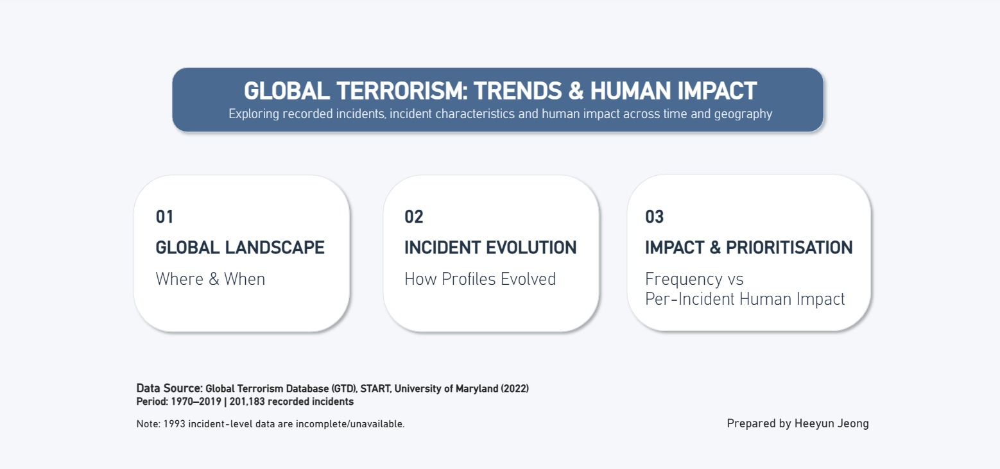
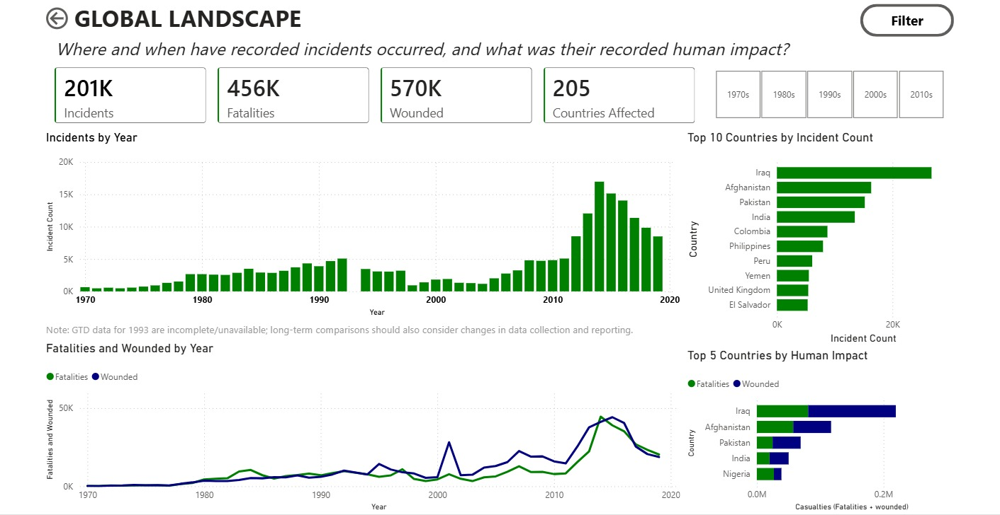
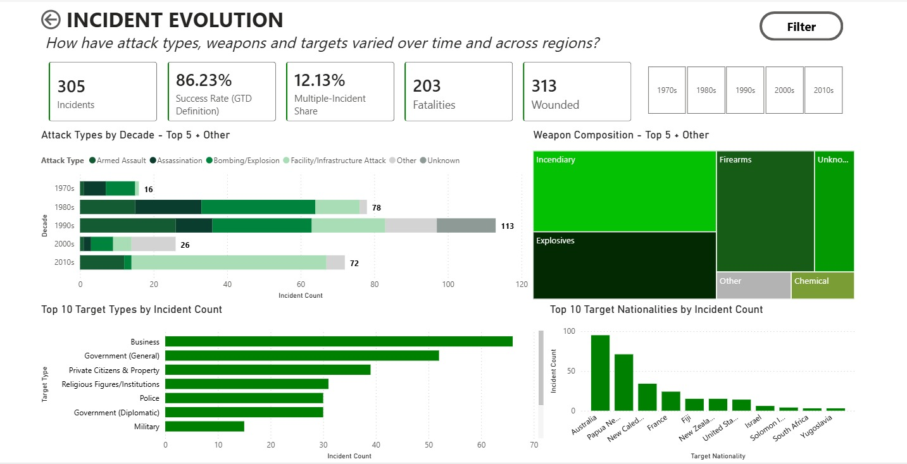
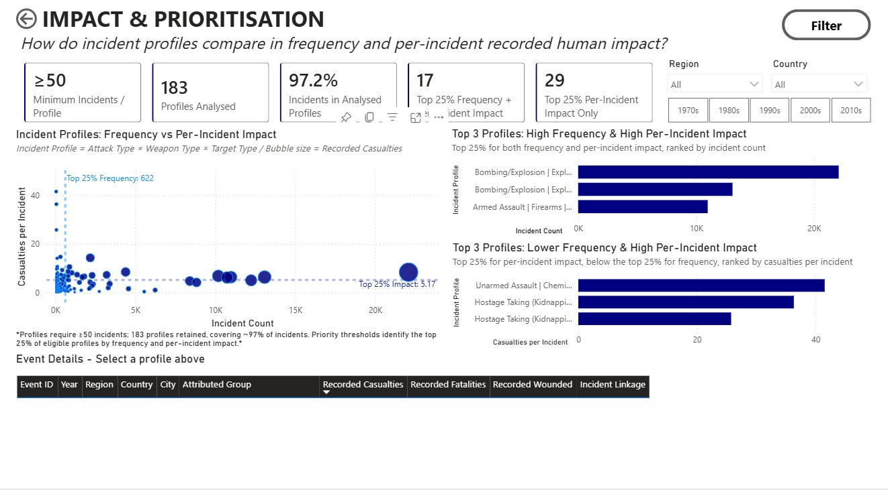
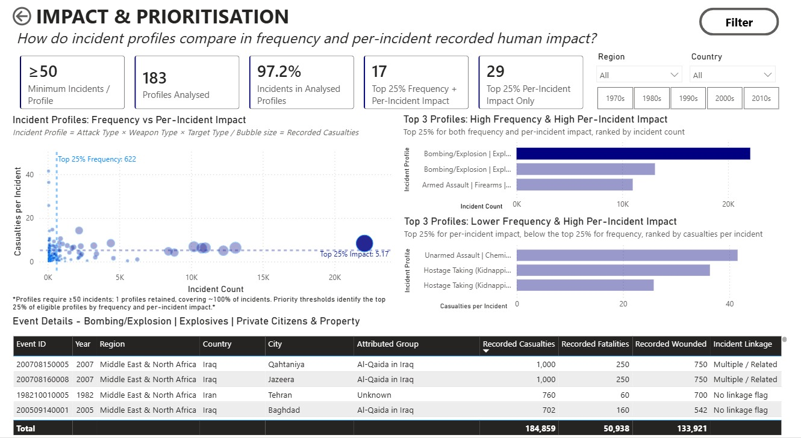

# Global Terrorism Power BI Dashboard

Interactive Power BI analysis of historical terrorism patterns, incident characteristics and recorded human impact using the Global Terrorism Database.

## Project Overview

This project analyses 201,183 recorded incidents from 1970 to 2019.

I used Python for initial data exploration and preparation, and Power BI for data modelling, DAX calculations, and interactive visualisation.

The dashboard is structured around three questions:

1. Where and when were incidents recorded?
2. How did attack types, weapons and targets vary over time and across regions?
3. Which incident profiles stand out when comparing frequency and recorded human impact per incident?

## Dashboard

### Overview

### Global Landscape
Explores the overall scale, timing, geographic distribution and recorded human impact of incidents.

### Incident Evolution
Examines attack types, weapon types, target types and target nationalities across time and geography.

### Impact & Prioritisation
Combines Attack Type × Weapon Type × Target Type into an Incident Profile and compares profiles by frequency and recorded casualties per incident.

### Profile Drill-down
Users can select a profile and investigate the underlying recorded events in more detail.

## Tools

- Python
- Power BI
- Power Query
- DAX

## Analytical Approach

For the profile-level analysis:

**Incident Profile = Attack Type × Weapon Type × Target Type**

Profiles are compared using:

- Incident Count
- Recorded Casualties per Incident
- Total Recorded Casualties

A minimum threshold of 50 incidents was applied to reduce instability from very small profiles.

## Data Considerations

The original dataset contained 135 variables. After reviewing the GTD codebook and exploring the data in Python, I selected approximately 70 variables relevant to the analysis.

Missing, unknown and zero values were treated according to their definitions in the GTD codebook rather than being automatically treated as equivalent.

## Limitations

This dashboard uses historical observational data and should not be used to predict future incidents or make decisions on its own.

Key limitations include:

- 1993 incident-level data is excluded from the main GTD dataset
- data collection methods changed over time
- some detailed variables have limited data coverage
- rare incident profiles may be excluded from the profile comparison due to the minimum incident threshold

## Data Source

Global Terrorism Database (GTD)  
START, University of Maryland

[Official GTD page](https://www.start.umd.edu/data-tools/GTD)

Raw GTD data is not included in this repository.

## Future Development

Planned improvements include:

- profile-level drill-through pages
- deeper event-level analysis
- adjustable profile thresholds
- additional operational and economic impact analysis
